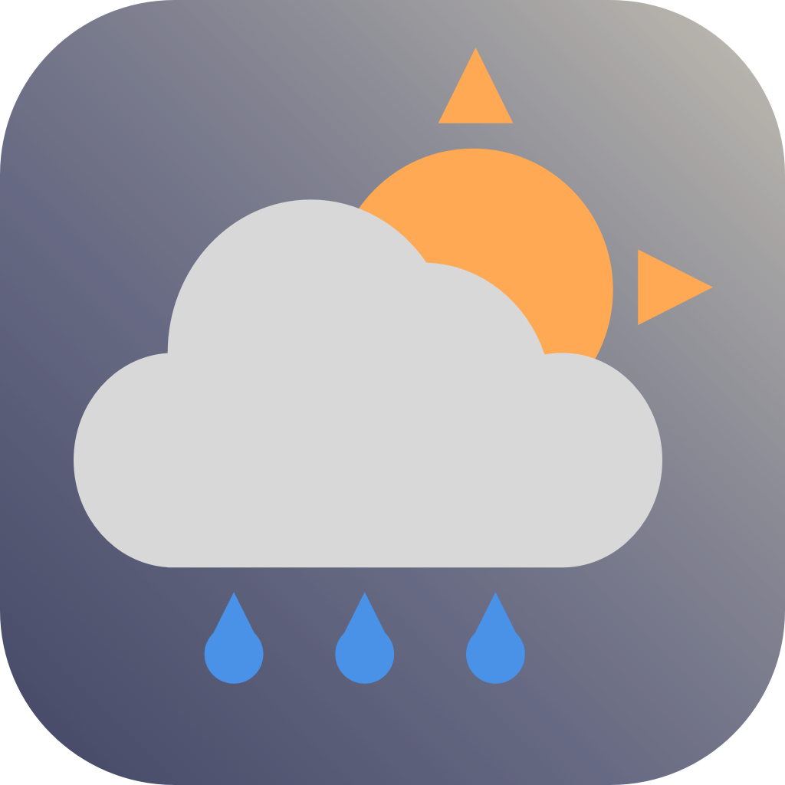
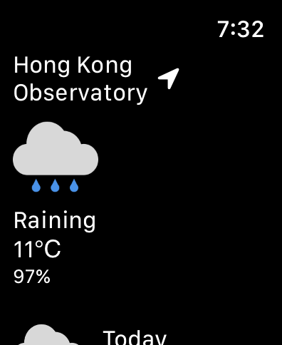

    
    <h1 align="center">HK Weather</h1>

## About this project
HK Weather is a comprehensive weather app built using SwiftUI. With this app, users can easily access the latest weather information for Hong Kong for up to 9 days in advance. The app provides real-time weather updates, ensuring that you always have the most up-to-date information at your fingertips.

# Download on App Store

## Framework Used
- SwiftUI 📱
- CoreLocation 📍
- WidgetKit 🎛️
- WatchKit ⌚
- Networking 🌐

## Features
- Show 9 days Hong Kong weather report
- Provide weather information near your location
- Support iOS, iPadOS, watchOS and macOS
- Widget available for quick access to weather information

## Compatibility
HK Weather is compatible with iOS, iPadOS, watchOS and macOS, allowing you to access the latest weather information from any of your Apple devices.

## Target platforms
- iOS 15.2 or later
- iPadOS 15.2 or later
- watchOS 8.3 or later
- macOS 12.0 or later

## Build requirements
- Swift 5.X
- XCode 10.2 or later

## Used API
Hong Kong Observatory Open Data API

## Screenshots

    
    
    

